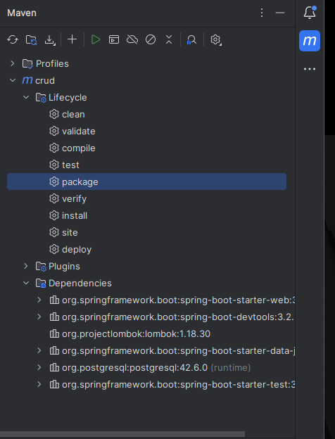

# Listar e adicionar usuário - Backend

Projeto simples de uma API REST desenvolvido em Java Spring e Spring MVC
(Maven - uma ferramenta de automação de construção e gerenciamento de projetos) e utilização do banco de dados Postgres

## Requisitos
- java21

## Clonando o repositório 
Primeiro você deve clonar o repositório 

```bash
git clone git@github.com:nicole-uchoa/back-crud-java.git
cd listar-usuarios-java-spring
```

## Inicializando o banco de dados
Para iniciar o postgres você deve, na raiz do projeto, executar no terminal o docker-compose 

```bash
docker-compose up --build
```
Agora nós temos o banco de dados para a nossa aplicação, já com uma tabela criada e alguns valores inseridos

## Executando o Backend

Utilizando o Intellij, as dependências Maven podem ser instaladas ao clicar no símbolo do Maven (a letra m) no canto superior direito da tela e clicar em package dentro do diretório Lifecycle
<h1 >
    
</h1>

Se preferir instalar por linha de comando você pode executar o seguinte comando

MacOS ou Linux
```bash
./mvnw clean install
```
Windows 
```bash
mvnw.cmd clean install
```
Para executar o projeto pela IDE entre no arquivo /src/main/java/CrudApplicaton e execute 
<h1 >
    
</h1>

Para executar por linha de comando 
```bash
mvn package
cd target
java -jar nome-do-arquivo-jar-gerado.jar
```

Você pode testar essa aplicação utilizando ferramentas como Postman ou Insomnia

Para integralização com o frontend vá para o repositório [listar-usuarios-react](https://github.com/nicole-uchoa/listar-usuarios-react)

## Links úteis 
[Instalar Java](https://www.oracle.com/java/technologies/downloads/)

[Instalar Intellij](https://www.jetbrains.com/pt-br/idea/download/?section=linux)

[Instalar docker](https://docs.docker.com/)

[Instalar Postman](https://www.postman.com/downloads/)